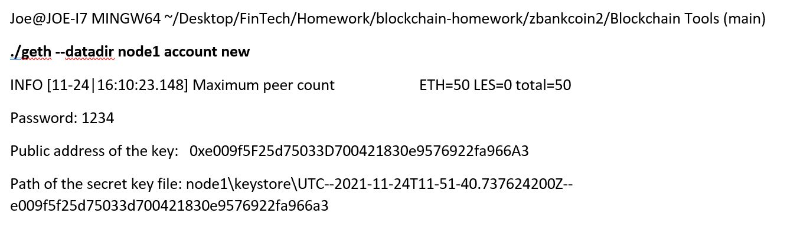
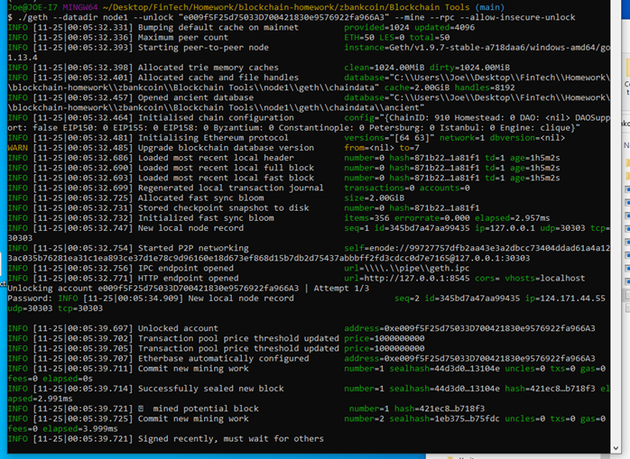

# POA Development Chain - zbankcoin2

## Creation of the zbankcoin2 Blockchain

## By Joe Colubriale

The first procedure is to setup a folder for this operation. I have called it
C:\Users\Joe\Desktop\FinTech\Homework\blockchain-homework\POA Development Chain

I then created a folder called Blockchain Tools. I then copied the "Go Ethereum Tools" contents into this folder

## Create Node 1
I used the following command to create Node 1. Note the password: 1234 and the additional summary info

## Create Node 2
I used the following command to create Node 2. Note the password: 1234 and the additional summary info

Below is the actual execution of the two commands above

1.	Run the application puppeth.exe from the Blockchain Tools folder.
To do this from the GitBash terminal you need to execute the following command
./puppeth.exe
2. It will ask for a network name. I have chosen the name zbankcoin2
3. Then select option “2. Configure new genesis”

Below are all the options I selected including the use of the addresses of the 2 nodes created above

 

 

  

I then issued the following command 

./geth --datadir node1 init zbankcoin2.json
./geth --datadir node2 init zbankcoin2.json

### How to start the Zbankcoin2 Blockchain Network
Firt start Node 1 using the following command. 

./geth --datadir node1 --unlock "e009f5F25d75033D700421830e9576922fa966A3" --mine --rpc --allow-insecure-unlock

Then put in the Password: 1234. To startup the second Node run the command as follows

./geth --datadir node2 --unlock "12CeEEa8e8Afd8986eC7AA2ECC758bc049644Cd0" --mine --port 30304 --bootnodes "enode://99727757dfb2aa43e3a2dbcc73404ddad61a4a123ac035b76281ea31c1ea893ce37d1e78c9d96160e18d673ef868d15b7db2d75437abbbff2fd3cdcc0d7e7165@127.0.0.1:30303" --ipcdisable --allow-insecure-unlock

And then type the password: 1234 even if you are not prompted

Below is what you will see when you run these two commands

 

Open Mycrypto Wallet and create a link to the new zbnkcoin2 network as follows

 

Then select Network

 

Then select "View and Send" and select address and amount that you want to send zbankcoin2 to 

 

Here is an actual transaction on our zbankcoin2 Blockchain network

